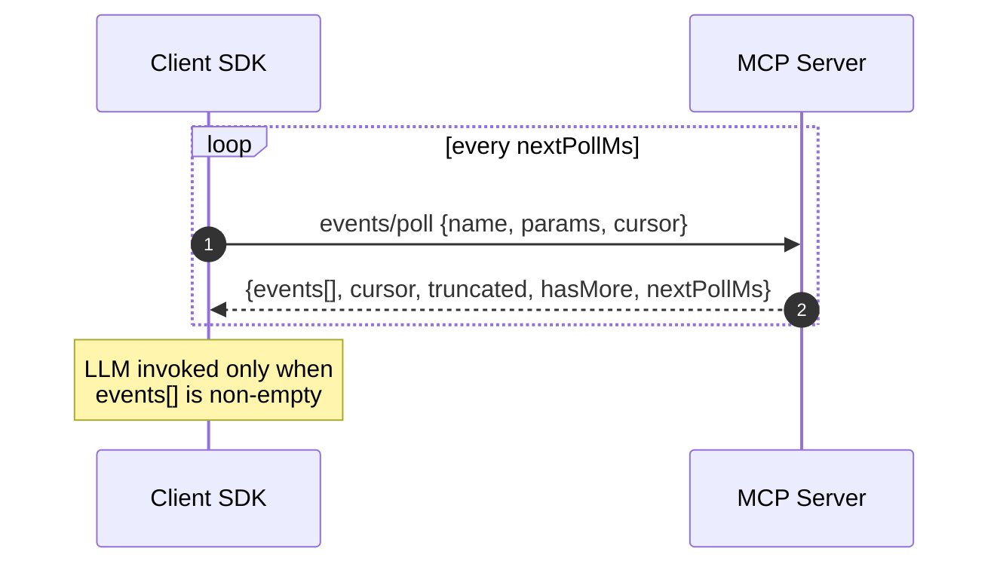
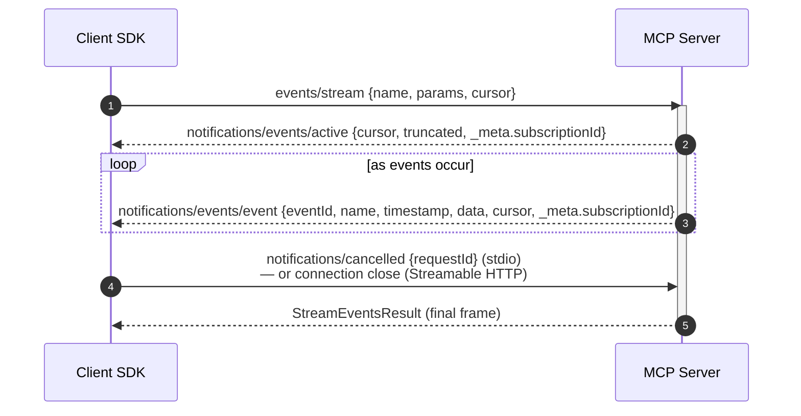
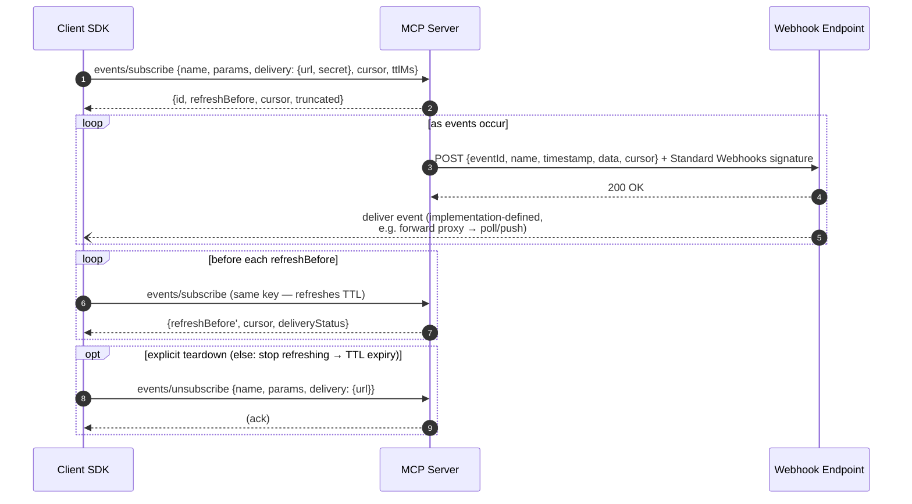
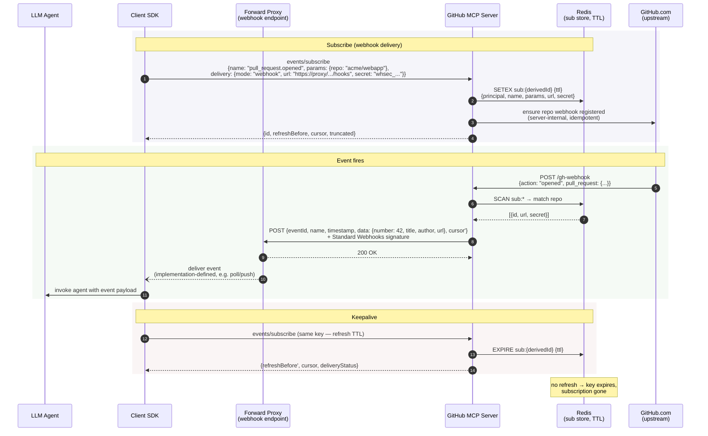

<!-- Canonical copy of the MCP Events design sketch, PR #1 on
     modelcontextprotocol/experimental-ext-triggers-events (branch pja/design-sketch),
     fetched 2026-06-11. Author: Peter Alexander (Anthropic). Reproduced here verbatim
     for reference while implementing this prototype. -->

# MCP Events — Design Sketch

**Status:** Draft proposal
**Authors:** Peter Alexander
**Date:** 2026-02-19

## Summary

Events lets an MCP client subscribe to things happening in an upstream system — a Slack message, a GitHub push, a PagerDuty incident — and have the agent react when they occur, without the user being present. A server declares event types via `events/list` (each with a name, an `inputSchema` for subscription params, a `payloadSchema`, and the delivery modes it supports). The client subscribes with `(name, params)` and receives event occurrences `{eventId, name, timestamp, data, cursor}`.

**Delivery modes.** Three, advertised per event type; none is mandatory. **Poll** (`events/poll`) is request/response: client sends `{name, params, cursor}`, gets back `{events[], cursor, nextPollMs}`. **Push** (`events/stream`) is a long-lived request: events arrive as `notifications/events/event`, with a heartbeat carrying the current cursor during quiet periods. **Webhook** (`events/subscribe`) registers an `https` callback URL plus a client-supplied `whsec_` secret; the server POSTs each event there, signed per Standard Webhooks (`webhook-id/-timestamp/-signature` + `X-MCP-Subscription-Id`); subscriptions carry a TTL the client suggests (`ttlMs`) and the server grants (`refreshBefore`, SHOULD be ≤ the suggestion; `null` = no expiry), and the client refreshes before `refreshBefore`. The client SDK negotiates the mode and runs the loop; the model only sees arriving events.

**Cursors and replay.** A cursor is an opaque server-defined position. The client persists the cursor it receives and passes it back on the next poll/reconnect/refresh; the server resumes from there. Servers whose upstream has no addressable history return `cursor: null` (no replay). `maxAgeMs` bounds replay so a stale cursor doesn't dump an unbounded backlog. `eventId` (preferably the upstream's stable id) is for client-side dedup. Reliable, ordered delivery is achievable when the upstream is durable, but not mandated — `truncated: true` in any response signals events were skipped (stale cursor, `maxAgeMs` floor, or server-side ceiling).

**State and identity.** The client owns the canonical subscription list. Poll is per-request; push is connection-scoped; webhook requires an authenticated principal and is TTL-scoped state keyed on `(principal, delivery.url, name, params)` — how durably the server holds it is the server's choice, coupled to the TTLs it grants (short TTLs → in-memory soft state recovered by refresh; long or no expiry → the server takes on durability; see *Subscription TTL*). The response returns a server-derived `id` for routing only. `events/unsubscribe` is eager cleanup; otherwise subscriptions lapse at TTL expiry. Authorization is the same MCP principal as for tools; event payloads are untrusted data with the same injection considerations as tool results.

## Capability Declaration

Servers advertise event support in their capabilities:

```jsonc
{
  "capabilities": {
    "events": {
      "listChanged": true
    }
  }
}
```

## Listing Available Events

### Request: `events/list`

```jsonc
// params (optional)
{ "cursor": "..." }  // pagination
```

### Response

```jsonc
{
  "events": [
    {
      "name": "email.received",
      "description": "Fires when a new email arrives in the inbox",
      "delivery": ["poll"],
      "inputSchema": {
        "type": "object",
        "properties": {
          "from": { "type": "string", "description": "Glob pattern for sender address" },
          "subject_contains": { "type": "string" },
          "redact_pii": { "type": "boolean", "default": false, "description": "Strip PII from event payloads" },
          "include_body_preview": { "type": "boolean", "default": true, "description": "Include a snippet of the email body" }
        }
      },
      "payloadSchema": {
        "type": "object",
        "properties": {
          "messageId": { "type": "string" },
          "from": { "type": "string" },
          "subject": { "type": "string" },
          "receivedAt": { "type": "string", "format": "date-time" }
        }
      }
    },
    {
      "name": "incident.created",
      "description": "Fires when a new PagerDuty incident is created",
      "delivery": ["webhook", "push", "poll"],
      "inputSchema": {
        "type": "object",
        "properties": {
          "severity": { "type": "string", "enum": ["P1", "P2", "P3", "P4"] },
          "service": { "type": "string" },
          "deduplicate_window_seconds": { "type": "integer", "default": 0, "description": "Suppress duplicate alerts within this window" }
        }
      },
      "payloadSchema": { "..." : "..." },
      "_meta": { "..." : "..." }   // optional; same semantics as on Tool/Resource/Prompt
    }
  ],
  "nextCursor": "..."   // present when more pages are available; same semantics as tools/list etc.
}
```

**Notes:**

- `delivery` lists the delivery modes this event type supports — any non-empty subset of `"poll"`, `"push"`, `"webhook"`. No mode is mandatory. A client that cannot use any of the listed modes cannot subscribe to this event type.
- `inputSchema` is a JSON Schema describing valid subscription parameters — these may include filters (which narrow the event stream), transforms (which modify payloads), or other server-defined configuration. This mirrors the `inputSchema` on tools for consistency.
- `payloadSchema` describes the shape of `data` in delivered events.

### Dynamic Event Types: `notifications/events/list_changed`

If the set of available event types changes at runtime (e.g., a plugin is loaded, a data source is connected), the server sends a `notifications/events/list_changed` notification. The client SHOULD re-call `events/list` to refresh its event type registry. This is consistent with `notifications/tools/list_changed` and `notifications/resources/list_changed`.

## Subscribing and Event Delivery

There are three delivery modes with different subscription mechanisms:

- **Poll mode:** Client calls `events/poll` with event name, params, and cursor. No separate subscribe step needed — the first poll with a null cursor bootstraps the subscription. Server holds no protocol-required state (the SDK MAY track an ephemeral poll lease for lifecycle hooks; see *Unsubscribe timing by mode*).
- **Push mode:** Client opens a long-lived `events/stream` request per subscription. Events are delivered on the SSE response stream (HTTP) or as notifications on stdout (stdio). Closing the request stream terminates the subscription. Server state is scoped to request lifetime.
- **Webhook mode:** Client calls `events/subscribe` to register a callback URL. The server POSTs events to that URL as they occur. Subscriptions carry a TTL negotiated at subscribe time — the client suggests a lifetime, the server grants one (possibly no expiry; see *Subscription TTL*). Unless granted no expiry, the client must periodically refresh by re-calling `events/subscribe` before the TTL expires; if it stops refreshing, the subscription expires and the server reclaims resources. Designed for remote servers where maintaining a long-lived connection is impractical.

### Error Codes

| Code | Message | Meaning |
|------|---------|---------|
| `-32602` | `InvalidParams` | Request is statically invalid — params don't match the event's inputSchema, the callback `delivery.url` is malformed or non-`https`, or `delivery.secret` is not a valid `whsec_` value (standard JSON-RPC invalid params). |
| `-32011` | `NotFound` | A referenced entity does not exist — an unknown event name, or no subscription matching the key on `events/unsubscribe`. The method implies which; `data.kind` (`"event"` \| `"subscription"`) MAY disambiguate. |
| `-32012` | `Forbidden` | The authenticated principal is not permitted for this event/params combination, or its access was revoked. |
| `-32013` | `ResourceExhausted` | A server-imposed limit or quota was reached. `data.limit` names it (e.g. `"subscriptions"`); `data.max` MAY give the ceiling. |
| `-32014` | `Unsupported` | The request is well-formed but a requested capability or option is not supported here — e.g. a delivery mode the event type does not offer. `data` identifies it (e.g. `{ "feature": "deliveryMode", "value": "push" }`). |
| `-32015` | `CallbackEndpointError` | A client-supplied callback endpoint failed verification or could not be reached (webhook mode only). `data.reason` is one of the `lastError` categories (`connection_refused`, `timeout`, `tls_error`, `http_4xx`, `http_5xx`, `challenge_failed`). |

These are **general-purpose** codes — named for reuse across MCP, not scoped to events — carried in the JSON-RPC implementation-defined server range `[-32000, -32099]` alongside MCP's existing `-32003`/`-32004`/`-32042`. Each conveys its specifics through a typed `data` payload (the same pattern as `UnsupportedProtocolVersionError.data`), so one code spans a family of conditions without minting new numbers, while clients still distinguish every case they branch on (by code, by method, or by a typed `data` discriminator). They are intended as candidates for promotion to the base MCP error registry; until then this extension defines them and future SEPs SHOULD reuse them rather than introduce overlapping codes. (`-32002 ResourceNotFound`, cited in earlier drafts, is not present in the current MCP schema; `NotFound` is its general replacement.)

### Poll-Based Delivery

The client SDK calls `events/poll` at the server-recommended interval. This is a protocol-level operation, NOT an LLM tool call.



#### Request: `events/poll`

Each `events/poll` request carries one subscription. A client with multiple subscriptions runs one poll loop per subscription.

```jsonc
{
  "name": "email.received",
  "params": {
    "from": "*@anthropic.com",
    "redact_pii": true
  },
  "cursor": null,                 // null = start from now
  "maxAgeMs": 300000,               // optional; do not replay events older than this many milliseconds (see Cursor Lifecycle)
  "maxEvents": 50                 // optional; cap events returned
}
```

#### Response

```jsonc
{
  "events": [
    {
      "eventId": "evt_001",
      "name": "email.received",
      "timestamp": "2026-02-19T15:30:00Z",
      "data": {
        "messageId": "msg_xyz",
        "from": "dsp@anthropic.com",
        "subject": "MCP spec review",
        "receivedAt": "2026-02-19T15:29:58Z"
      }
    }
  ],
  "cursor": "historyId_99842",
  "truncated": false,
  "hasMore": false,
  "nextPollMs": 30000
}
```

#### `EventOccurrence` schema

Each entry in `events[]`, the params of `notifications/events/event`, and the body of webhook event deliveries is an `EventOccurrence` (push notifications additionally carry the stream's subscription id in `_meta` — see *Push-Based Delivery*; webhook also sends non-event control bodies — see *Non-event webhook bodies*):

| Field | Type | Required | Description |
|---|---|---|---|
| `eventId` | string | yes | Stable identifier for deduplication |
| `name` | string | yes | Event type name |
| `timestamp` | string (ISO 8601) | yes | When the event occurred |
| `data` | object | yes | Payload conforming to the event type's `payloadSchema` |
| `cursor` | string \| null | no | Subscription position after this event (push/webhook only; poll carries cursor at the response level). `null` when the event type does not support replay — see *Cursor Lifecycle*. |
| `_meta` | object | no | Reserved for protocol/extension metadata, consistent with `_meta` on other MCP types. Not governed by `payloadSchema`. |

**Notes:**

- `cursor` is opaque to the client. The client stores it and passes it back on the next poll. In the request, `null` means "start from now" — the server returns no events and provides a fresh cursor for subsequent polls. In the response, the server MAY return `cursor: null` for an event type that does not support replay; the client then has nothing to persist and always polls with `null` (see *Cursor Lifecycle*).
- `eventId` enables client-side deduplication across polls (e.g., after a crash/restart). It is **server-assigned**: when the upstream source provides a stable event identifier (Stripe `evt_*`, GitHub delivery GUID, Kafka offset, Gmail message ID), the server SHOULD use that value as `eventId` so that the same upstream event surfaced via multiple paths (e.g., webhook emit and poll backfill) carries the same `eventId` and dedup works. The SDK auto-generates an `eventId` only when the author supplies none.
- `maxEvents` is an optional cap on the number of events returned. If more events are available than the limit, the server returns a partial batch with an intermediate cursor and sets `hasMore: true`. The client SHOULD poll again immediately (ignoring `nextPollMs`) to drain the backlog. If omitted, the server uses its own default limit.
- `hasMore` indicates whether additional events are available beyond the returned batch. When `true`, the client should poll again immediately with the updated cursor. When `false`, the client waits `nextPollMs` before the next poll.
- `nextPollMs` allows the server to dynamically adjust polling frequency (e.g., back off when rate-limited upstream, speed up when activity is detected). Ignored when `hasMore` is `true`. Clients SHOULD apply a configurable floor (default 1000 ms) to guard against a misbehaving server inducing a tight loop.
- Empty `events` array means nothing happened — this is the common case and should be cheap.
- The server holds no protocol-required per-client subscription state. Each poll request is self-contained: the client provides the event name, params, and cursor. The server does not need to "remember" previous poll requests to answer them. (The SDK MAY hold ephemeral derived state — a poll-lease table to drive `on_subscribe`/`on_unsubscribe`, and for emit-only event types a ring buffer of recent events — but neither is required to answer a poll, both are reconstructable, and neither is owed to any particular client. See *Unsubscribe timing by mode* and *Emit-only event types* under Server SDK Guidance.)
- Errors (`NotFound`, `Forbidden`, `InvalidParams`, `Unsupported`) are returned as a standard JSON-RPC error response for the request — there is no partial-success model since each request carries one subscription.

### Push-Based Delivery

Push delivery uses a long-lived `events/stream` request — one per subscription. The client opens a stream for each subscription and the server delivers events as they occur. The request is a standard JSON-RPC request with an `id`, which enables cancellation via `notifications/cancelled` and is echoed in every notification for routing.

The transport mechanism differs by transport type:

- **Streamable HTTP:** The `events/stream` request is a POST that returns an SSE response stream. This stream carries event notifications (`notifications/events/*`); it is independent of, and does not replace, the transport's existing GET-based SSE stream, which continues to carry non-event server-initiated notifications (`notifications/tools/list_changed`, progress, logging, etc.). The client cancels by aborting the request stream (TCP close on HTTP/1.1, `RST_STREAM` on HTTP/2) — no explicit cancellation message is needed.
- **stdio:** The `events/stream` request is sent on stdin. The server delivers events as JSON-RPC notifications on stdout. Since there is no connection to close, the client cancels by sending `notifications/cancelled` with the request's `id`.



#### Request: `events/stream`

```jsonc
// Streamable HTTP: POST /mcp
// stdio: written to stdin
{
  "jsonrpc": "2.0",
  "method": "events/stream",
  "id": 1,
  "params": {
    "name": "email.received",
    "params": { "from": "*@anthropic.com", "redact_pii": true },
    "cursor": null,
    "maxAgeMs": 300000
  }
}
```

#### Event Delivery

If the subscription is invalid (`NotFound`, `Forbidden`, `InvalidParams`, `Unsupported`), the server responds immediately with a JSON-RPC error and no stream is opened. Otherwise the server confirms the subscription and delivers events as notifications. Every `notifications/events/*` message carries the JSON-RPC `id` of the parent `events/stream` request in `params._meta["io.modelcontextprotocol/subscriptionId"]` (per [SEP-2575](https://github.com/modelcontextprotocol/modelcontextprotocol/pull/2575)'s correlation convention) so a client with multiple concurrent streams (especially on stdio, where all share one stdout) can route notifications to the correct stream.

```jsonc
// Confirmation
{"jsonrpc":"2.0","method":"notifications/events/active","params":{"cursor":"historyId_99840","truncated":false,"_meta":{"io.modelcontextprotocol/subscriptionId":1}}}

// Events as they occur
{"jsonrpc":"2.0","method":"notifications/events/event","params":{"eventId":"evt_001","name":"email.received","timestamp":"2026-02-19T15:30:00Z","data":{"messageId":"msg_xyz","from":"dsp@anthropic.com","subject":"MCP spec review"},"cursor":"historyId_99842","_meta":{"io.modelcontextprotocol/subscriptionId":1}}}

// Transient per-occurrence error (stream stays open)
{"jsonrpc":"2.0","method":"notifications/events/error","params":{"error":{"code":-32603,"message":"UpstreamError","data":{"reason":"Gmail API 503"}},"_meta":{"io.modelcontextprotocol/subscriptionId":1}}}

// Final frame when stream closes (StreamEventsResult)
{"jsonrpc":"2.0","id":1,"result":{"_meta":{}}}
```

`notifications/events/error` reports a recoverable failure (e.g., a single upstream fetch failed); the subscription remains active and the server retries and resumes. Only `notifications/events/terminated` (see *Authorization*) ends the subscription. A gap (e.g., the cursor fell outside the upstream's retention window) is *not* an error — the server sends a fresh `notifications/events/active {cursor:<fresh>, truncated:true, _meta.subscriptionId}` and continues delivering (see *Cursor Lifecycle*).

On Streamable HTTP, notifications are SSE `data:` frames; when the server terminates the stream it sends the `StreamEventsResult` as the final `data:` frame, but when the client terminates by aborting the request stream no result can be sent (see *Cancellation*). On stdio, notifications are newline-delimited JSON messages on stdout.

The `events/stream` response carries only `notifications/events/*` messages. Non-event MCP notifications (`notifications/tools/list_changed`, `notifications/resources/updated`, progress, logging) continue to use the transport's existing channels and are unaffected by this proposal.

#### Lifecycle

- **Stream termination.** The `StreamEventsResult` is an empty typed result (`{"_meta": {}}`). It carries no information — it satisfies JSON-RPC's requirement that every request gets a response. All meaningful content is in the preceding notifications. It is sent whenever the server can write a final frame: on Streamable HTTP only when the server initiates the close; on stdio the server MAY send it, and clients MUST NOT depend on receiving it.
- **Heartbeat.** The server MUST send periodic keepalive messages on the push stream so the client can distinguish "nothing to send" from "connection is dead." The heartbeat is `{"jsonrpc":"2.0","method":"notifications/events/heartbeat","params":{"cursor":"historyId_99850","_meta":{"io.modelcontextprotocol/subscriptionId":1}}}` — `cursor` is the position the server has checked up to, so the client's persisted cursor advances even when no events match (see *Cursor Lifecycle*); it is `null` for event types that do not support replay. On Streamable HTTP this is sent as an SSE `data:` frame; the SSE comment form (`: keepalive`) is not used since it cannot carry cursor state. The server SHOULD send a heartbeat at least every 30 seconds. Clients SHOULD NOT apply their default request timeout to `events/stream`; the heartbeat is the liveness signal, and a client that has received neither an event nor a heartbeat for more than twice the heartbeat interval SHOULD treat the stream as dead and reconnect with its cursor.
- **Cancellation.** On Streamable HTTP, the client aborts the request stream. On stdio, the client sends `notifications/cancelled` with the `requestId` matching the `events/stream` request's `id`. In both cases, the server MUST stop delivering events and release any associated resources. On stdio, the server MAY then send the `StreamEventsResult`; base MCP says servers SHOULD NOT respond to cancelled requests, so omitting it is the expected behaviour. On Streamable HTTP, the abort is the terminal signal and no result is sent.
- **Concurrent streams.** A client MAY hold multiple concurrent `events/stream` requests open, one per subscription. To add a subscription, open an additional stream; to remove one, cancel only its stream. On HTTP/1.1 each stream consumes a TCP connection, so clients with many subscriptions effectively depend on HTTP/2 multiplexing; on stdio, concurrent streams share stdout and are demultiplexed via `_meta["io.modelcontextprotocol/subscriptionId"]`. Server SDKs MUST exempt `events/stream` from any general request-concurrency cap, since each push subscription is a long-lived request that never completes until cancelled.
- **Reconnection after failure.** If the connection drops (HTTP) or the server stops sending (stdio), the client sends a new `events/stream` with the same subscription and its last-known cursor.

#### Cursor Advancement

Each event notification on the push stream includes a `cursor` field. This cursor represents the subscription's position *after* this event. The client tracks the latest cursor per subscription for use during reconnection. The server MAY send `cursor: null` for event types that do not support replay (see *Cursor Lifecycle*).

### Webhook-Based Delivery

Webhook delivery is for remote MCP servers where maintaining a long-lived connection (push) or frequent polling is impractical. The server POSTs events to a callback URL provided by the client. Webhook subscriptions are TTL-scoped: the client suggests a lifetime, the server grants one, and the subscription expires if the client stops refreshing before the granted expiry. The TTL is the server's resource-control knob — short grants keep subscriptions as in-memory soft state cleaned up by expiry; long or no-expiry grants shift the durability and cleanup burden onto the server (see *Subscription TTL*).

The callback URL does not need to be the client itself. A common deployment is a forward proxy that receives webhooks and serves events to clients via poll or push:

```
Upstream → MCP Server → webhook POST → Forward Proxy ← Client (poll or push)
```



#### Subscribing: `events/subscribe`

Unlike poll and push, webhook delivery requires an explicit subscribe step because the server needs to know where to POST events. `events/subscribe` is idempotent — calling it again with the same subscription key (see *Subscription Identity* below) refreshes the TTL and updates mutable fields. This is the mechanism clients use to keep subscriptions alive.

```jsonc
{
  "jsonrpc": "2.0",
  "method": "events/subscribe",
  "id": 2,
  "params": {
    "name": "incident.created",
    "params": { "severity": "P1" },
    "delivery": {
      "mode": "webhook",
      "url": "https://proxy.example.com/hooks/client123",
      "secret": "whsec_<base64-of-24-to-64-random-bytes>"
    },
    "cursor": null,
    "maxAgeMs": 300000,
    "ttlMs": 3600000                  // suggested TTL; omit = server default, null = request no expiry (see Subscription TTL)
  }
}
```

```jsonc
// Response
{
  "id": "sub_a3f1c8e2b0d49f7e",       // server-derived; stable for this (principal, url, name, params)
  "refreshBefore": "2026-02-19T16:30:00Z",  // authoritative grant; SHOULD be ≤ the suggested ttlMs; null = no expiry (see Subscription TTL)
  "cursor": "cursor_start_001",       // safe-to-persist watermark (same semantics as payload cursor); advances the client's cursor even if no events arrive before next refresh (see Cursor Lifecycle)
  "truncated": false                  // true if delivery started later than the supplied cursor (retention window, maxAgeMs floor, or server-side ceiling)
}
```

**Notes:**

- `events/subscribe` is ONLY used for webhook delivery. Poll and push do not need it.
- `delivery.secret` is REQUIRED. The client supplies the HMAC signing secret; the server never generates one. The value MUST be a Standard Webhooks symmetric secret: the literal prefix `whsec_` followed by base64 of 24–64 random bytes. Servers MUST reject values that do not satisfy this with `InvalidParams`. Client SDKs SHOULD generate the secret on the application's behalf rather than expose an interface that encourages hand-picked values.
- `id` (response only) is a server-derived handle for the subscription, deterministic over `(principal, delivery.url, name, params)`. The server returns it so the receiver can route deliveries (it appears in the `X-MCP-Subscription-Id` header on every POST). It is stable across refreshes and server restarts. The client does not generate or send it.
- `cursor` (request) tells the server where to begin delivery. `null` means "start from now." A non-null value requests replay from that position (honoured when the event type is backed by a durable upstream). The cursor is **client-owned**: the server does not persist a per-subscription cursor position across restarts; it computes a safe-to-persist watermark for inclusion in each delivered payload (see *Webhook Event Delivery*) and returns that same watermark in each subscribe/refresh response so the client's cursor advances during quiet periods. Both sources carry the same value semantics, so the client persists whichever it receives most recently and supplies it on every refresh. If the subscription is live, the supplied cursor is at or behind the server's in-flight position and the server treats it as a no-op (delivery continues uninterrupted). If the subscription has lapsed or the server has restarted, the cursor becomes the replay point. This means clients use a single rule — always pass the last-persisted cursor — and the server is idempotent under it.
- `ttlMs` (request, optional) is the client's suggested subscription lifetime; `refreshBefore` (response, always present, nullable) is the server's authoritative grant — an ISO 8601 timestamp indicating when the subscription will expire, or `null` for no expiry. See *Subscription TTL* below for the negotiation rules. Unless granted no expiry, the client MUST re-call `events/subscribe` with the same subscription key before `refreshBefore` to keep the subscription alive; the server re-grants a TTL on each refresh.
- `cursor` (response) is the same **safe-to-persist watermark** the server includes in delivery payloads — i.e., a position at or before which everything has been acknowledged or abandoned. Returning it here lets the client's cursor advance during quiet periods when no event POSTs arrive; without this, a long quiet stretch could leave the client holding a cursor older than the upstream's retention window. When deliveries are in flight, the response cursor is at or behind the upstream head (it does not advance past unacked events), so persisting it never skips anything. It is `null` for event types that do not support replay.
- `events/subscribe` is idempotent within the caller's subscription scope (see *Subscription Identity*). If a subscription with the same scoped key exists, the server resets the TTL and updates mutable fields in place. If the subscription has expired — or the server has restarted and lost it — the server creates a fresh subscription using the provided cursor.
- The server holds subscription state (event name, params, callback URL, secret, derived id) with a per-subscription TTL. How durably it holds that state is its own choice, coupled to the TTLs it grants. A server granting short TTLs can keep everything in memory — if it restarts, clients re-subscribe on their next refresh cycle; for event types backed by a durable upstream, the client's persisted cursor recovers any events that occurred during the gap, while emit-only event types lose them (see *Emit-only event types*). A server granting long or no-expiry TTLs MUST retain subscriptions for the lifetime it granted, including across restarts (see *Subscription TTL*).

#### Subscription TTL

Every webhook subscription has a lifetime negotiated at subscribe time: the client suggests, the server decides, and the server's answer is authoritative.

- `ttlMs` (request, optional, nullable integer) is the client's suggested lifetime in milliseconds. The client knows best how long it is likely to be around — a short-lived session should suggest minutes; a long-lived tenant holding many subscriptions can suggest days or more, so it isn't forced to spend time refreshing on a cadence the server invented. Omitting the field means "server default." An explicit `ttlMs: null` requests a subscription with **no expiry**.
- `refreshBefore` (response) is the grant. It SHOULD be less than or equal to the suggestion — the client asked for what it can commit to refreshing, and granting longer risks the server delivering to an endpoint past the client's expected lifetime. The one sanctioned exception is a server-side floor: a server MAY clamp an impractically short suggestion up to its minimum TTL to protect itself from refresh storms. Clamping in either direction is self-announcing — the client reads the granted `refreshBefore` and schedules its refresh loop from that, so a clamped grant is not an error and there is no rejection path for TTL values.
- `refreshBefore: null` grants **no expiry**: the subscription persists until `events/unsubscribe` or server-initiated termination. A server MUST NOT return `null` unless the client suggested `ttlMs: null` — no expiry exceeds every finite suggestion. A server unwilling to grant it simply returns a finite `refreshBefore`, which the client treats like any other grant.

**TTL is the server's resource-control knob.** A server that wants refresh-driven cleanup and in-memory soft state grants short TTLs. A server that grants long TTLs is choosing to hold subscription state for that long, and should hold it durably enough to honour the grant. There is no sharp boundary to defend here: a one-year TTL is, in every practical sense, unlimited, and excluding `null` from the protocol would only invite "999 years." Offering no expiry explicitly lets the spec attach the real obligations to it. A server that grants no expiry accepts that:

- the client is not expected to refresh or unsubscribe, ever — keeping the subscription alive is now the server's job, not the client's;
- restart recovery via the refresh cycle no longer applies — the server MUST persist no-expiry subscriptions across restarts, because a client that never refreshes will never detect (or repair) a silently dropped one;
- TTL expiry no longer garbage-collects orphans or dead endpoints — the server MAY drop a no-expiry subscription after sustained delivery failure (server-defined window), and SHOULD attempt a `terminated` envelope when it does.

Even with no expiry, clients SHOULD still re-call `events/subscribe` occasionally: the refresh response is where the cursor advances during quiet periods, where `deliveryStatus` surfaces delivery problems, and where suspended delivery reactivates (see *Webhook Event Delivery*). The difference is that correctness no longer depends on it.

#### Subscription Identity

Webhook subscriptions are keyed by a compound **subscription key** that determines which `events/subscribe` calls refer to the same logical subscription. The server uses this key for idempotent upsert on subscribe, for lookup on unsubscribe, and to isolate tenants from one another.

**Authentication required.** `events/subscribe` and `events/unsubscribe` MUST be called with an authenticated principal; servers MUST reject calls without an authorized principal with `-32012 Forbidden`. Without a principal in the key, the tuple `(delivery.url, name, params)` is guessable and any caller could unsubscribe or rotate another tenant's secret. Unauthenticated MCP servers may offer poll and push, but not webhook.

**Key composition.** The subscription key is `(principal, delivery.url, name, params)`, where `principal` is the server's canonical identifier for the authenticated subject (e.g., OAuth `sub`, API key ID, service-account name). `params` is compared by canonical-JSON equality. There is no client-generated `id` — a subscription is fully determined by what it listens for, where it delivers, and who asked.

All four components are immutable for the subscription's lifetime: a subscribe call with a different value for any of them addresses a different subscription. To change what a subscription listens for or where it delivers, `events/unsubscribe` the old one and `events/subscribe` a new one. This avoids the case where `name`/`params` change in place but the upstream listener provisioned by `on_subscribe` remains bound to the old values.

**Derived `id`.** The server computes a deterministic `id` over the key (e.g., a truncated SHA-256 of the canonical key serialization) and returns it in the subscribe response. This is a routing handle, not a capability: it appears in `X-MCP-Subscription-Id` on every delivery and MAY be logged. Knowing it does not authorize anything.

On an idempotent subscribe against an existing key, the server updates the remaining fields as follows:

| Field | Behavior on existing subscription |
|---|---|
| `delivery.secret` | Replaced. To rotate, the client supplies a new value on refresh; the server SHOULD dual-sign (Standard Webhooks multi-signature) with old and new for a short grace window so in-flight deliveries verify under either. |
| `cursor` | The server treats the supplied value as the client's last-persisted position. If the subscription is live and the cursor is at or behind the current in-flight position, this is a no-op. If the subscription has lapsed or the server restarted, delivery (re)starts from this position. The server does not store this value beyond initiating delivery. |
| TTL | Re-granted. The refresh carries a (possibly different) `ttlMs` suggestion and the server returns a fresh `refreshBefore` under the same rules as the initial subscribe — so a client can lengthen or shorten its refresh cadence, or convert a no-expiry subscription back to a finite one by suggesting a finite `ttlMs`. |
| `active` | Set to `true`. A successful refresh is the client's liveness signal; if delivery had been suspended (`active: false` in `deliveryStatus`) due to repeated failures, the server resumes retrying pending events. |

**Cross-tenant isolation.** Because the key includes `principal` and `delivery.url`, two distinct tenants subscribing to the same `(name, params)` get distinct subscriptions. A caller who learns another tenant's derived `id` gains nothing — `id` is not accepted as input to any method.

#### Webhook Event Delivery

The server POSTs events to the callback URL as they occur:

```
POST https://proxy.example.com/hooks/client123
Content-Type: application/json
webhook-id: evt_789
webhook-timestamp: 1739980800
webhook-signature: v1,<base64 HMAC-SHA256(secret, "evt_789.1739980800." + body)>
X-MCP-Subscription-Id: sub_a3f1c8e2b0d49f7e

{
  "eventId": "evt_789",
  "name": "incident.created",
  "timestamp": "2026-02-19T16:00:00Z",
  "data": {
    "incidentId": "INC-1234",
    "title": "Database connection pool exhausted",
    "severity": "P1"
  },
  "cursor": "cursor_xyz"
}
```

**Notes:**

- Deliveries follow the [Standard Webhooks](https://github.com/standard-webhooks/standard-webhooks/blob/main/spec/standard-webhooks.md) signature scheme. `webhook-id` carries the `eventId` for event deliveries (per-delivery, used for dedup; control envelopes use `msg_<type>_<random>` — see *Non-event webhook bodies*). `webhook-timestamp` is the Unix timestamp (seconds) of the request. `webhook-signature` is `v1,<base64>` where the value is `HMAC-SHA256(secret, webhook-id + "." + webhook-timestamp + "." + body)`; multiple space-delimited signatures MAY be present during secret rotation. `X-MCP-Subscription-Id` is an MCP-specific header (not part of Standard Webhooks) carrying the subscription `id` so the receiver can select the correct secret before parsing the body. The receiver MUST verify the signature before processing, SHOULD reject deliveries where `webhook-timestamp` is more than 5 minutes old, and SHOULD deduplicate on `webhook-id`. Each retry attempt regenerates the timestamp and signature.
- `eventId` in the body enables idempotent processing. The receiver SHOULD deduplicate by this value.
- `cursor` in the body is a **safe-to-persist watermark**: it represents a position such that every event at or before it has been acknowledged by the endpoint or abandoned by the server. The server computes this from its in-memory retry queue — it does not include `cursor_N` in event N's payload until events at positions `< N` have been acked or given up on. Computing this requires the server to hold, per active subscription, the upstream position and ack status of in-flight events; this is in-memory TTL-scoped state (lost on restart, reconstructed by client refresh), but it is per-subscription bookkeeping the SDK must implement. The client persists every cursor it receives; the most recently received value is always safe to supply on refresh. The server MAY send `cursor: null` for event types that do not support replay (see *Cursor Lifecycle*); in that case there is no recovery point to persist. The endpoint MUST make `cursor` and `eventId` available to the consuming client by whatever channel it uses to forward events; cursor-based recovery on resubscribe depends on the client receiving and persisting this value.
- **Delivery model.** The server retries each event independently with exponential backoff on non-`2xx` responses. This matches the dominant webhook convention (Stripe, GitHub, Shopify, the Standard Webhooks spec). Concurrent deliveries and retries may therefore arrive out of order; the receiver uses `eventId` for deduplication and `timestamp` for ordering if needed. Because the payload `cursor` is a watermark (not the event's own position), out-of-order arrival does not cause the client to persist an unsafe cursor.
- **Acknowledgement semantics.** A `2xx` response from the webhook endpoint signals that the event has been accepted and the server need not retry it. The endpoint SHOULD NOT return `2xx` until the event has been durably persisted or forwarded — an endpoint that ACKs and then loses the event leaves recovery dependent on the client's last-persisted cursor, which may predate the lost event. At-least-once delivery in webhook mode holds between server and endpoint; end-to-end delivery to the agent depends on the endpoint honouring this contract.
- **Subscribe/delivery race.** Because the secret is client-supplied, the receiver can verify the very first delivery — there is no window where a delivery arrives before the receiver knows the secret. A receiver that gets a delivery for an `id` it has not yet been told to route (e.g., the subscribe response has not propagated to the gateway) SHOULD return a retryable status (`503` or `425 Too Early`); the server's retry/backoff redelivers once the receiver is ready. `eventId` deduplication and cursor replay make this safe.
- After repeated failures (server-defined threshold), the server MAY suspend delivery (`deliveryStatus.active: false`). A subsequent successful refresh reactivates it (sets `active: true`) and the server resumes retrying pending events; if the client never refreshes, the subscription expires naturally at TTL. A no-expiry subscription has no such backstop: the server MAY drop it after sustained delivery failure (server-defined window) and SHOULD attempt a `terminated` envelope when it does (see *Subscription TTL*).

#### Non-event webhook bodies

In addition to `EventOccurrence` bodies, the server POSTs control envelopes to the callback URL. A body with a top-level `type` field is a control envelope; a body without one is an `EventOccurrence`. These are signed and headed exactly like event deliveries (Standard Webhooks headers + `X-MCP-Subscription-Id`); the body carries a `type` discriminator instead of `eventId`/`data`. `webhook-id` for control envelopes is a per-message identifier of the form `msg_<type>_<random>` so receivers can dedup retries. The endpoint MUST forward control envelopes to the consuming client by the same channel it forwards events.

| `type` | Body | Sent when |
|---|---|---|
| `gap` | `{"type":"gap","cursor":"<fresh>"}` | A gap is detected between refreshes (see *Gaps and `truncated`*). The client persists `cursor` and treats it as `truncated: true`. |
| `terminated` | `{"type":"terminated","error":{"code":...,"message":...,"data":...}}` | The subscription has ended (e.g., authorization revoked). The subscription no longer exists server-side. |
| `verification` | `{"type":"verification","challenge":"<nonce>"}` | Sent before activating delivery to an unverified `(principal, url)` (see *Webhook Security → Endpoint verification*). The endpoint echoes `challenge` in a `2xx` body to prove intent; the server activates delivery only on a constant-time match. |

#### Webhook Delivery Status

The `events/subscribe` response MAY include a `deliveryStatus` object when refreshing an existing subscription. This lets the client detect delivery problems without a separate monitoring channel:

```jsonc
// Healthy subscription refresh
{
  "id": "sub_a3f1c8e2b0d49f7e",
  "refreshBefore": "2026-02-19T17:00:00Z",
  "cursor": "cursor_xyz",
  "truncated": false,
  "deliveryStatus": {
    "active": true,
    "lastDeliveryAt": "2026-02-19T16:28:00Z",
    "lastError": null
  }
}
```

```jsonc
// Subscription with delivery failures
{
  "id": "sub_a3f1c8e2b0d49f7e",
  "refreshBefore": "2026-02-19T17:00:00Z",
  "cursor": "cursor_xyz",
  "truncated": false,
  "deliveryStatus": {
    "active": false,
    "lastDeliveryAt": "2026-02-19T15:45:00Z",
    "lastError": "http_4xx",
    "failedSince": "2026-02-19T15:50:00Z"
  }
}
```

`deliveryStatus` is OPTIONAL — servers MAY omit it entirely. When present, `active` indicates whether the server is currently delivering events (`false` means it has suspended retries after repeated failures; the refresh that returned this status has just reactivated it). `lastError` MUST be a server-generated category string — one of `connection_refused`, `timeout`, `tls_error`, `http_4xx`, `http_5xx`, `challenge_failed` — and MUST NOT include raw response bodies, headers, or status lines from the endpoint, to avoid serving as a response oracle for attacker-chosen URLs. The client can use this information to diagnose connectivity or authentication issues with the webhook endpoint. The same categories also appear as `data.reason` on a `-32015 CallbackEndpointError` returned synchronously from `events/subscribe`.

#### Webhook Security

**SSRF prevention.** The server MUST validate callback URLs. Servers SHOULD reject URLs whose resolved IP is not globally routable per the [IANA IPv4](https://www.iana.org/assignments/iana-ipv4-special-registry/) and [IPv6](https://www.iana.org/assignments/iana-ipv6-special-registry/) Special-Purpose Address Registries (illustrative examples: `127.0.0.0/8`, `10.0.0.0/8`, `172.16.0.0/12`, `192.168.0.0/16`, `169.254.0.0/16`, `::1`, `fc00::/7`, `fe80::/10`) unless explicitly configured to allow them. To prevent DNS rebinding, this validation MUST be performed at delivery time, not only at subscribe time: the server resolves the hostname, checks the resolved IP against the blocklist, and connects directly to that validated IP (sending the original hostname in the `Host` header / TLS SNI) so the address cannot change between check and connect. Subscribe-time validation alone is insufficient — a rebinding attacker returns a public IP at subscribe time and a private IP at delivery time. Webhook delivery requests MUST NOT follow HTTP redirects, since a redirect can target an internal address that bypasses the blocklist. Servers MAY additionally maintain an allowlist of permitted callback URL patterns.

**Endpoint verification (anti-flooding).** Client-supplied HMAC stops a third party from being *deceived* (forged deliveries fail verification) but not from being *flooded* — an attacker can subscribe a victim's URL with an attacker-chosen secret and the victim still receives every POST. So a server MUST NOT begin delivering to a callback URL until the endpoint's intent to receive deliveries is confirmed, by **either**: (a) a **verification handshake** — before activating, the server POSTs a `verification` control envelope carrying a single-use, short-lived `challenge` nonce (signed and headed like any delivery), and the endpoint proves intent by echoing the nonce in a `2xx` body (`{"challenge":"<nonce>"}`), which the server compares in constant time; or (b) the URL matching a server-configured **allowlist**. A reachable endpoint that fails to echo yields `-32015 CallbackEndpointError` with `data.reason: "challenge_failed"`; an unreachable one yields the same code with the relevant connection-failure category (`connection_refused`, `timeout`, or `tls_error`).

Verification is cached per `(principal, url)`: a successful handshake or allowlist hit covers that principal's subscriptions to that URL across refreshes and `params`, so varying `params` cannot multiply verification POSTs at a victim and one principal's verification never waives the challenge for another. The cache is in-memory TTL-scoped soft state like the subscription itself; after a restart the server re-verifies on the next subscribe. A server that persists no-expiry subscriptions across restarts (see *Subscription TTL*) MUST persist their verification status alongside them — a persisted subscription resumes delivery without a re-subscribe, so there is no later handshake to lean on, and the stored record only exists because verification succeeded. The verification POST MUST use the same SSRF-hardened path as deliveries (delivery-time IP validation, no redirects) and SHOULD be rate-limited per destination host; failures surface only via the `lastError` category `challenge_failed`, never raw endpoint responses.

**Server identity (optional).** A server MAY additionally sign deliveries and verification POSTs with an asymmetric key — Standard Webhooks `v1a,` (ed25519), appended alongside the `v1,` HMAC — so a gateway can verify *which* server sent a delivery, enforce a known-server allowlist, and retain protection if an HMAC secret leaks. The verifying public key MUST be discovered from an origin the client already authenticates, and never from the challenge or delivery body, which the attacker controls (that would be trust-on-first-use). The discovery mechanism is a SEP-review-time decision contingent on [SEP-2127](https://github.com/modelcontextprotocol/modelcontextprotocol/pull/2127) (server cards), still draft: if server cards are published before this extension, the key is carried inline on the server's card (provisionally a `webhooks.signingKeys` member holding an ed25519 JWK set); otherwise it is published as a standalone JWKS document at a well-known path on the server's origin, `/.well-known/mcp-webhook-jwks.json`. Exactly one of these will be normative in the final SEP — they are not two options offered to implementers. Either way the key is fetched from the same origin the gateway connects to for MCP, and is distinct from the OAuth `jwks_uri` ([RFC 8414](https://www.rfc-editor.org/rfc/rfc8414)), which carries the authorization server's token-signing keys, not the MCP server's webhook-signing key. Keys carry a `kid`; rotation publishes the new key alongside the old. Endpoints that do not enforce server identity ignore `v1a,`.

**TLS requirement.** Callback URLs MUST use `https://`. Servers MUST reject `events/subscribe` with a non-`https` `delivery.url` (`-32602 InvalidParams`). Event payloads and the `delivery.secret` (sent in the subscribe request) would otherwise transit in cleartext.

**Signature scheme (Standard Webhooks profile).** MCP webhook delivery is a profile of [Standard Webhooks](https://github.com/standard-webhooks/standard-webhooks/blob/main/spec/standard-webhooks.md). Every delivery MUST include `webhook-id` (the `eventId` for event deliveries; `msg_<type>_<random>` for control envelopes), `webhook-timestamp` (Unix seconds), and `webhook-signature`. The signature is `HMAC-SHA256(secret, webhook-id + "." + webhook-timestamp + "." + body)` encoded as base64 with a `v1,` prefix. In this formula, `body` is the raw HTTP request body bytes exactly as received, before any parsing or re-serialization; the `webhook-id + "." + webhook-timestamp + "."` prefix is UTF-8; and `secret` is the base64-decoded bytes of the value after the `whsec_` prefix. Receivers MUST compute the HMAC over the raw body, never over a re-serialized JSON object. The header MAY contain multiple space-delimited signatures (`v1,<sigA> v1,<sigB>`) during secret rotation; the receiver accepts if any verifies. Each retry attempt MUST regenerate the timestamp and signature so retries are not rejected by the receiver's freshness window. The receiver SHOULD reject deliveries where `webhook-timestamp` is more than 5 minutes old. Off-the-shelf Standard Webhooks verifiers (e.g., Svix libraries) work without modification.

In addition to the Standard Webhooks headers, deliveries MUST include `X-MCP-Subscription-Id` (the subscription `id`) so the receiver can select the correct secret without parsing the body. This is the only MCP-specific header; everything else conforms to Standard Webhooks.

**Secret generation.** The signing secret is supplied by the client in `delivery.secret` and is REQUIRED — the server never generates one. This places the secret with the party that verifies deliveries (the gateway/receiver), so the receiver is ready to verify the first POST without any post-subscribe coordination, and a subscription pointed at an endpoint that didn't originate the secret fails verification by construction. Servers MUST reject a `delivery.secret` that is not `whsec_` followed by base64 decoding to 24–64 bytes (per Standard Webhooks); client SDKs SHOULD generate it from a CSPRNG by default.

**Secret rotation.** The client supplies a new `delivery.secret` on a refresh call; the idempotent upsert replaces it. The server SHOULD dual-sign deliveries with both the old and new secrets for a short grace window (Standard Webhooks space-delimited multi-signature) so in-flight deliveries verify under either. There is no server-initiated rotation.

**Authentication to the callback endpoint.** HMAC is the only authentication mechanism the protocol defines between the MCP server and the callback endpoint. This matches the dominant pattern for product webhooks (Stripe, GitHub, Slack, Twilio all authenticate deliveries with HMAC alone) and keeps the server's per-subscription credential surface to a single secret.

HMAC is verified by application code after the request has been routed. It does not help if the callback URL sits behind infrastructure that requires transport-level auth before routing — an API gateway that demands `Authorization: Bearer`, a cloud endpoint requiring a platform-issued identity token, an mTLS-only mesh. For those deployments, point the callback at a forward proxy under the tenant's control: the proxy presents a public endpoint to the MCP server, terminates HMAC, and re-authenticates to downstream services using whatever mechanism the internal network requires. The protocol does not provide a way to pass through bearer tokens, perform an OAuth client-credentials grant, or attach OIDC identity tokens on the tenant's behalf; these may be considered for a future revision if deployment experience warrants it.

**Delivery profile (for WAF / private-cloud deployments).** Gateways are commonly fronted by a WAF, API gateway, or ingress controller that needs static rules to admit legitimate deliveries. The following invariants are intended to be relied on by such infrastructure:

- **Method:** deliveries are HTTP `POST` only.
- **Content-Type:** `application/json`.
- **Required headers:** `webhook-id`, `webhook-timestamp`, `webhook-signature`, and `X-MCP-Subscription-Id` are present on every delivery (see *Signature scheme*). A WAF MAY drop requests missing any of them as a cheap pre-filter; HMAC remains the actual security boundary.
- **Body size:** servers SHOULD keep delivery bodies at or under 256 KiB, consistent with *Payload Minimality*. Receivers and intermediaries MAY reject larger bodies with `413 Payload Too Large`; servers MUST treat `413` as a non-retryable failure for that event.
- **TLS:** `https` is mandatory for `delivery.url`. Intermediaries MAY terminate TLS; nothing in the verification path depends on end-to-end TLS (the HMAC covers the raw body and timestamp).
- **User-Agent:** not specified by this document. A standard MCP user-agent format is under discussion in [SEP-1336](https://github.com/modelcontextprotocol/modelcontextprotocol/pull/1336); if adopted, webhook deliveries would follow it. WAF rules SHOULD NOT rely on UA matching as a security control regardless.
- **Source IP allowlisting:** defence-in-depth, not the security boundary. A discovery mechanism for server egress ranges is deferred to the MCP Server Card work in [SEP-2127](https://github.com/modelcontextprotocol/modelcontextprotocol/pull/2127); until then, servers SHOULD document their egress ranges out-of-band. Gateways that cannot obtain stable ranges (serverless, dynamic NAT) rely on HMAC alone, which is sufficient.

#### Unsubscribing: `events/unsubscribe`

`events/unsubscribe` is an eager cleanup mechanism. It is not required for correctness — subscriptions will expire naturally when the client stops refreshing. However, calling it immediately frees server resources and stops webhook deliveries without waiting for TTL expiry. No-expiry subscriptions never lapse, so `events/unsubscribe` is the only client-initiated cleanup for them — but a server that grants no expiry MUST NOT count on receiving it (see *Subscription TTL*).

```jsonc
{
  "jsonrpc": "2.0",
  "method": "events/unsubscribe",
  "id": 3,
  "params": {
    "name": "incident.created",
    "params": { "severity": "P1" },
    "delivery": { "url": "https://proxy.example.com/hooks/client123" }
  }
}
```

`events/unsubscribe` resolves the subscription using the same key as `events/subscribe` — `(principal, delivery.url, name, params)`. The client supplies `name`, `params`, and `delivery.url`; `principal` comes from the auth layer. The derived `id` is not accepted as input.

`events/unsubscribe` is ONLY used for webhook delivery. Poll subscriptions are implicit (stop polling to unsubscribe). Push subscriptions are scoped to the `events/stream` request (close or cancel to unsubscribe).

## Listing Active Subscriptions

The client owns all subscription state across all three delivery modes. There is no server-side subscription listing method. The client maintains its own subscription registry and can reconstruct server-side state at any time via idempotent `events/subscribe` (for webhook mode) or by resuming poll/push with stored cursors.

Enterprise governance tools can inspect the client SDK's subscription registry for audit purposes. For webhook mode, orphaned subscriptions (e.g., from a crashed client) are cleaned up automatically by TTL expiry — no server-side listing is needed. No-expiry subscriptions are the exception: their cleanup is the granting server's responsibility (failure-based GC per *Webhook Event Delivery*), which is part of what a server accepts by granting them.

## Cursor Lifecycle

Cursors are opaque strings managed by the server. They represent a position in the event stream.

**Replay is optional per event type.** A server MAY return `cursor: null` in any delivery (poll result, push `notifications/events/event` and `notifications/events/active`, webhook payload) when the event type does not support replay — typically because the upstream is push-only with no addressable history. A client receiving `cursor: null` MUST NOT attempt to persist or replay from it; on reconnect/resubscribe it sends `cursor: null` (start from now) and accepts that events during the gap are not recoverable. Servers SHOULD be consistent: an event type that ever returns a non-null cursor SHOULD always do so, and one that returns `null` SHOULD always return `null`, so clients can branch once at subscribe time rather than per delivery.

**Initial cursor:** Passing `cursor: null` in any mode means "start from now." The server returns a fresh cursor representing the current position (or `null` if the event type does not support replay). No historical events are replayed.

**Cursor advancement without events.** The client's persisted cursor must advance during quiet periods so it doesn't fall outside the upstream's retention window when nothing is happening. Poll covers this inherently (every response carries `cursor`, including when `events: []`). For push, the heartbeat carries `cursor` (see *Heartbeat* under Push-Based Delivery). For webhook, each `events/subscribe` refresh response carries `cursor`. In all three the value is safe to persist (for webhook it is the same watermark as in delivery payloads, never ahead of unacked events); the client persists it exactly as it would a cursor from a delivered event.

**Bounding replay with `maxAgeMs`.** All three modes accept an optional `maxAgeMs` (integer milliseconds) alongside `cursor`. When present, the server begins replay from whichever is *later*: the supplied `cursor`, or `now − maxAgeMs`. This lets a client resubscribe with a stale cursor without receiving an unbounded backlog — e.g., a host that was offline for a week can pass its persisted cursor with `maxAgeMs: 300000` to get at most the last five minutes. If the floor advances past the cursor, the server SHOULD set `truncated: true` on the first response (poll result / `notifications/events/active` / webhook subscribe response) so the client knows older events were skipped. Servers whose upstream supports time-addressed reads (e.g., Gmail `after:`, Slack `oldest=`, Kafka `offsetsForTimes`) SHOULD seek directly; others MAY honour `maxAgeMs` by replaying from `cursor` and discarding events whose `timestamp` is older than the floor — or, if that would be prohibitively expensive (e.g., a week-old cursor with `maxAgeMs: 300000`), MAY instead reset to now and return `truncated: true`, which yields the same client-visible outcome without the wasted scan. Servers MAY also apply their own replay ceiling independent of `maxAgeMs` and MUST signal it via `truncated: true` when they do. `maxAgeMs` is ignored when `cursor` is `null` (null already means "now"; replay from before the subscription's start is out of scope per *What Is NOT in v1*) and for event types that do not support replay.

**Gaps and `truncated`.** `truncated: true` is the single signal that the server started delivery from a position later than the cursor the client supplied — i.e., events were skipped. Causes are not distinguished on the wire: the supplied cursor may have fallen outside the upstream's retention window, the `maxAgeMs` floor may have advanced past it, or the server may have applied its own replay ceiling. In all cases the server resets to a position it can serve from, returns that position as the fresh `cursor` alongside `truncated: true`, and continues — the client never reconnects or re-subscribes in response. `truncated: true` always implies a possible gap; clients SHOULD treat it as such (e.g., re-fetch authoritative state via tools if it matters) and persist the fresh cursor.

| Mode | Where `truncated` appears |
|---|---|
| Poll | The result body: `{events:[], cursor:<fresh>, truncated:true, hasMore, nextPollMs}`. Never a JSON-RPC error. |
| Push | A `notifications/events/active {cursor:<fresh>, truncated:true, _meta.subscriptionId}` is sent (initially, and again mid-stream if a gap occurs); delivery continues on the same stream. |
| Webhook | The subscribe/refresh response: `{id, refreshBefore, cursor:<fresh>, truncated:true, ...}`. For a gap detected between refreshes, the server POSTs a `{"type":"gap","cursor":"<fresh>"}` control envelope (see *Non-event webhook bodies*) so the client learns of it without waiting for the next refresh. |

For event types that do not support replay (`cursor` is always `null`), `truncated` SHOULD be `false` and clients SHOULD ignore it — there is no position to have advanced past.

## Server SDK Guidance

The server SDK should make implementing events as simple as implementing tools. The server author writes one function — a "check for changes since cursor" function — and the SDK handles delivery mechanics for all three modes (poll, push, and webhook). The same check function backs every delivery mode; the SDK decides how to deliver based on what the client requested.

By default the server author does not declare which delivery modes an event type supports. The SDK infers them from the server's configuration and transport:

- **Poll** is backed by the check function when one is provided, or by the SDK's emit-fed ring buffer otherwise (see *Emit-only event types* below). The SDK SHOULD enable poll by default so it's available unless the author opts out.
- **Push** is available when the transport supports streaming (Streamable HTTP or stdio).
- **Webhook** is available when the server has `webhook_ttl` configured.

The SDK computes the `delivery` array in `events/list` responses from the above, minus any modes the author has explicitly disabled. Servers that call `server.emit()` for an event type additionally enable real-time push and webhook delivery without the SDK needing to run an internal polling loop.

```python
@server.event(
    name="email.received",
    description="New email arrives",
    input_schema={ ... },
    payload_schema={ ... },
)
async def check_email(context, params, cursor):
    """Called by the SDK for all delivery modes."""
    if cursor is None:
        # Bootstrap: return current position, no events
        current = await gmail.history().get_current_id()
        return EventResult(events=[], cursor=current)

    history = await gmail.history().list(startHistoryId=cursor)
    events = []
    for msg in history.messages:
        if matches_params(params, msg):
            data = {"messageId": msg.id, "from": msg.sender, ...}
            if params.get("redact_pii"):
                data = redact(data)
            events.append(Event(name="email.received", eventId=msg.id, data=data))
    return EventResult(events=events, cursor=history.historyId)
```

The SDK calls this function in different contexts depending on the delivery mode, but the server author does not need to distinguish between them:

**For poll mode:** The SDK calls the check function for the incoming `events/poll` request and returns the result. The server is stateless.

**For push mode:** The SDK supports two patterns:

- **Poll-driven push (default).** The SDK maintains an internal polling loop per push subscription, calling the check function periodically and writing events to the stream. This is the simplest path for servers wrapping poll-only APIs (e.g., Gmail's history endpoint).
- **Direct emit.** Servers with true push sources (webhooks, WebSocket listeners, change streams) can emit events directly via `server.emit()`. The SDK routes emitted events to all active push streams with matching subscriptions.

Push state is scoped to the lifetime of the `events/stream` connection — when the connection closes, all loops and listeners stop.

**For webhook mode:** The SDK uses the same two patterns (poll-driven or direct emit), but instead of writing to an SSE stream, it POSTs events to the subscriber's callback URL with HMAC signatures. The SDK holds webhook subscriptions with per-subscription TTLs granted within the server's configured cap. When granted TTLs are short, in-memory state is sufficient — no external storage is required: if the server restarts, all webhook subscriptions are lost and clients re-subscribe on their next refresh cycle, passing their last-persisted cursor; for event types backed by a durable upstream this resumes without gaps, while emit-only event types lose events that occurred during the outage. This is the deliberate trade: short TTL + refresh substitutes for durable subscription storage. A server configured to grant long or no-expiry TTLs MUST instead persist subscriptions for the lifetime it grants (see *Subscription TTL*); SDKs SHOULD refuse a no-expiry cap unless the author has wired up durable storage.

```python
# Short granted TTLs let the SDK keep subscription state in memory —
# clients refresh before expiry, so nothing needs to survive a restart.
server = MCPServer(
    webhook_ttl=timedelta(minutes=30),  # cap on granted TTL; client suggestions are clamped to ≤ this
)
```

**Direct emit works across all modes.** When `server.emit()` is called, the SDK routes the event to all active subscriptions with matching event name. The SDK supports two emit patterns:

- **Broadcast emit.** The server emits an event without specifying a subscription. The SDK fans out per active subscription for that event name using two author-supplied hooks:
  - `match(ctx, event, params) -> bool` decides whether the subscription receives the event. If absent, all subscriptions for that event name receive it.
  - `transform(ctx, event, params) -> event` shapes the payload for that subscription (e.g., apply `redact_pii`, expand or thin the payload per a subscriber's `expand` param). If absent, the event is delivered as emitted.

  `ctx` carries the subscription's principal and request metadata. Because param semantics are author-defined (filters, globs, transforms — see `inputSchema`), the SDK cannot evaluate them generically; these hooks let the author own both filtering and shaping. The SDK applies the same hooks when an `events/poll` request reads from the emit-only ring buffer, so poll subscribers see the same filtering and shaping as push/webhook subscribers. This pattern fits upstream sources that deliver all events regardless of subscription params (e.g., a PagerDuty webhook that fires for every incident — `match` filters by `severity`, `transform` redacts fields per subscriber).
- **Targeted emit.** The server emits an event to a specific subscription by ID. This is appropriate when the server has set up a per-subscription upstream listener and already knows which subscription the event belongs to.

```python
@server.event(name="incident.created", ...)
class IncidentCreated:
    @staticmethod
    def match(ctx: Context, event: Event, params: dict) -> bool:
        sev = params.get("severity")
        return sev is None or event.data["severity"] == sev

    @staticmethod
    def transform(ctx: Context, event: Event, params: dict) -> Event:
        if params.get("redact_pii"):
            return event.replace(data={**event.data, "reporter": None})
        return event

# Broadcast emit — SDK calls match then transform per active subscription.
async def on_pagerduty_webhook(payload):
    server.emit(Event(
        name="incident.created",
        data={"incidentId": payload["id"], "severity": payload["severity"], ...}
    ))

# Targeted emit — server already knows the subscription.
async def on_slack_message(subscription_id, message):
    server.emit(Event(
        name="slack.message",
        data={"text": message.text, "channel": message.channel, ...}
    ), subscription_id=subscription_id)
```

**Emit-only event types.** Many upstream sources are push-only with no cursor-addressable change feed — the server author receives upstream events (via webhook, WebSocket, message bus, etc.) and has no meaningful `check()` function to write. For these event types, the server author declares the event with `emit_only=True` and omits the check function entirely:

```python
@server.event(
    name="incident.created",
    description="Fires when a new PagerDuty incident is created",
    emit_only=True,  # no check function; poll served from SDK ring buffer
    input_schema={ ... },
    payload_schema={ ... },
)
class IncidentCreated:
    pass

async def on_pagerduty_webhook(payload):
    server.emit(Event(name="incident.created", data={...}))
```

SDKs SHOULD provide an in-memory ring buffer that retains a bounded window of emitted events per event type (configurable by time and/or count). `events/poll` for an emit-only event type reads from this buffer. The cursor is a buffer-local sequence number; it is process-scoped — a server restart invalidates all cursors and clients receive `truncated: true` with a fresh cursor. Events emitted during server downtime are not recoverable. This matches the upstream's own guarantees for push-only sources and keeps the server author's implementation to a single `emit()` call per upstream event.

```python
server = MCPServer(
    emit_buffer=EmitBuffer(
        max_age=timedelta(minutes=10),   # retain 10 min of events
        max_events=10_000,               # cap per event type
    ),
)
```

For servers wrapping upstreams that *do* offer a durable cursor (Gmail historyId, Kubernetes resourceVersion, Stripe `/v1/events`, Kafka offset), authors SHOULD prefer a `check()` function that queries the upstream directly, so the MCP cursor is the upstream cursor and poll survives server restart without gaps.

**Subscription lifecycle hooks.** For events where the upstream source must be configured per subscription (e.g., "watch this Slack channel"), the server needs to know when subscriptions are added and removed. The SDK provides lifecycle hooks:

```python
@server.on_subscribe("slack.message")
async def on_subscribe(context, params, subscription_id):
    """Set up upstream listener for this subscription's params."""
    await slack.join_channel(params["channel"])

@server.on_unsubscribe("slack.message")
async def on_unsubscribe(context, params, subscription_id):
    """Tear down upstream listener."""
    await slack.leave_channel(params["channel"])
```

These hooks are called by the SDK across all delivery modes. The server author writes the upstream setup/teardown logic once; the SDK handles the delivery mechanics. Servers SHOULD enforce the subscription limit (`ResourceExhausted`) before invoking `on_subscribe`, so a rejected subscription never provisions upstream resources.

**Unsubscribe timing by mode.** Push and webhook have explicit end-of-life signals — push fires `on_unsubscribe` when the stream closes, webhook when `events/unsubscribe` is called or the TTL lapses. Poll does not: the client simply stops calling `events/poll`, and the server never sees a goodbye. To prevent poll-provisioned upstream resources from leaking, the SDK treats poll subscriptions as leased. The lease is keyed on `(principal-or-null, eventName, canonicalHash(params))` — on unauthenticated servers all callers share one lease per `(name, params)`. `on_subscribe` fires the first time a given key appears in a poll request; each subsequent poll for that key renews the lease; `on_unsubscribe` fires when the lease expires without renewal. This lease table is ephemeral SDK state, not protocol state: it is never persisted, and a server restart simply re-fires `on_subscribe` on the next poll. The lease window is SDK-configurable and SHOULD default to a small multiple of the server's typical `nextPollMs` so that a well-behaved client never lapses between polls:

```python
server = MCPServer(
    poll_subscription_ttl=timedelta(minutes=5),
)
```

This lease tracking is soft state the SDK maintains on the server author's behalf. It does not survive restart — on restart the next poll is "first sight" again and `on_subscribe` re-fires, which is the correct behavior since the upstream listener also needs re-establishing. Server authors SHOULD write `on_subscribe` to be idempotent for this reason.

## Client SDK Guidance

Event names and params are not known at code time — they are discovered at runtime via `events/list`, typically driven by the LLM. The client SDK provides a dynamic subscription API:

```python
client = MCPClient(
    server_url="...",
    webhook=WebhookConfig(                              # optional, global
        url="https://proxy.example.com/hooks/client123",
        # SDK generates a per-subscription whsec_ secret; pass secret_provider=... to supply your own
    ),
)

# Subscribe dynamically (e.g., driven by LLM decision after events/list)
sub = await client.subscribe(
    name="email.received",
    params={"from": "*@anthropic.com", "redact_pii": True},
)

# Receive events
async for event in sub:
    # Called regardless of delivery mode (poll, push, or webhook)
    details = await client.call_tool("get_email", {"id": event.data["messageId"]})
    # ... process the email

# Unsubscribe
await sub.cancel()
```

The SDK manages delivery mode selection, poll loops, push stream lifecycle, webhook refresh cycles, cursor tracking, deduplication by `eventId`, gap/`truncated` handling, and reconnection — all transparently.

### Delivery Mode Selection

The SDK intersects the event type's advertised `delivery` list with the modes the client is configured to use, and picks in this preference order:

1. **Webhook** if the client has `WebhookConfig` set and the server lists it — low latency without tying up a persistent connection.
2. **Push** if the transport supports streaming (stdio, or HTTP when webhook isn't configured) and the server lists it — low latency, but requires holding a connection open.
3. **Poll** — no server state, no persistent connection.

If none of the modes the server lists for that event type is usable by this client, the SDK raises `NoCompatibleDeliveryMode`. The caller can override per subscription:

```python
# Force poll
sub = await client.subscribe("email.received", params={...}, delivery="poll")

# Force push (error if server doesn't support it)
sub = await client.subscribe("email.received", params={...}, delivery="push")

# Force webhook (error if WebhookConfig not set or server doesn't support it)
sub = await client.subscribe("incident.created", params={...}, delivery="webhook")
```

### How Each Mode Works

**Poll mode:** The SDK runs a background loop per subscription that calls `events/poll` at the server-recommended interval (clamped to a configurable floor, default 1000 ms). Events are yielded to the subscription's async iterator. The caller does not implement or manage the polling loop.

**Push mode:** The SDK opens one `events/stream` per subscription and listens for notifications, routing them by `_meta["io.modelcontextprotocol/subscriptionId"]`. Adding a subscription opens a new stream; removing one cancels its stream. On HTTP/1.1 each stream is a TCP connection, so SDKs SHOULD prefer HTTP/2 when many subscriptions are active.

**Webhook mode:** The SDK generates a `whsec_` secret, registers it (or its derivation input) with the gateway, then calls `events/subscribe` with `delivery: {url, secret}`. The response provides the server-derived `id` for routing. It runs a background refresh loop, re-calling `events/subscribe` before `refreshBefore` expires (for a no-expiry grant, the loop drops to an occasional health-check cadence — see *Subscription TTL*). The SDK monitors `deliveryStatus` on each refresh to detect delivery failures. The webhook receiver (which may be a forward proxy) accepts incoming POSTs, looks up the secret by `X-MCP-Subscription-Id`, verifies the Standard Webhooks signature, checks timestamp freshness, and routes events to the appropriate subscription iterator. On `sub.cancel()`, the SDK calls `events/unsubscribe` for eager cleanup.

### Delivering Events to the LLM

When an event arrives (via any delivery mode), the client SDK surfaces it to the agent runtime. How this works depends on the agent framework — it might inject the event into the conversation context, trigger a new agent turn, or queue it for processing. The MCP spec does not prescribe this; it is an application-level concern.

## Security Considerations

### Threat Model

The threats this extension is designed to defend against, and the mechanism addressing each. Payload and authorization threats apply to all delivery modes; the rest are specific to webhook mode, the only mode that makes outbound requests to client-supplied URLs. Details are in the referenced sections.

| Threat | How it's addressed |
|---|---|
| Prompt injection via event payloads | Payloads are untrusted data — clients sanitize/sandbox before the LLM (as with tool results); servers keep payloads minimal to shrink the injection surface. *(Event Payloads Are Untrusted Data; Payload Minimality)* |
| PII / sensitive-data exposure in event infrastructure (logs, queues, buffers) | Payload minimality — deliver only triage fields (e.g. sender, subject, id) and fetch full content via tools on demand. *(Payload Minimality)* |
| Unauthorized subscription, or continued delivery after access is revoked | Subscribe-time permission check (`-32012 Forbidden`); periodic delivery-time re-verification; a `terminated` envelope ends the subscription when access is lost. *(Authorization)* |
| Treating event receipt as authority to act | Action-time authorization — the agent's response to an event goes through normal MCP authorization; receipt grants no privilege. *(Authorization)* |
| SSRF / DNS rebinding (server coerced into requesting internal hosts) | Delivery-time IP validation against the IANA special-purpose registries, connecting to the validated IP with the original Host/SNI, and no redirects; optional callback-URL allowlist. *(Webhook Security → SSRF prevention)* |
| Reflection / amplification DDoS (attacker subscribes a victim's URL) | Mandatory intent challenge (or allowlist) before activating delivery, cached per `(principal, url)`; subscribe and per-destination rate limits. *(Endpoint verification)* |
| Forged / spoofed deliveries (endpoint deceived into processing fake events) | Per-subscription HMAC (Standard Webhooks `v1,`); receiver verifies the signature before processing. *(Signature scheme)* |
| Server impersonation (endpoint cannot tell which server sent a delivery) | Optional asymmetric signing (`v1a,`) with the public key anchored to the server's trusted origin; gateways allowlist known servers. *(Server identity)* |
| Replay of captured deliveries | `webhook-timestamp` freshness window (reject > 5 min) and `eventId` deduplication; single-use, short-lived challenge nonce. *(Signature scheme; Endpoint verification)* |
| Signing-secret leakage | Per-subscription secrets limit blast radius; client-driven rotation with a dual-sign grace window; optional asymmetric signing as defence-in-depth. *(Secret rotation; Server identity)* |
| Eavesdropping in transit (payloads and `delivery.secret`) | TLS required — `https` callback URLs only; non-`https` subscribe is rejected. *(TLS requirement)* |
| Cross-tenant subscription tampering (guessing the tuple to unsubscribe or rotate another tenant's secret) | Webhook requires an authenticated principal; subscription identity includes `principal`; the derived `id` is a non-capability routing handle. *(Subscription Identity)* |
| Response oracle / internal-service probing via error detail | `deliveryStatus.lastError` is a fixed category string only — never raw endpoint bodies, headers, or status lines. *(Webhook Delivery Status)* |
| Server-side resource exhaustion (subscription flooding) | `-32013 ResourceExhausted` limits; webhook subscriptions expire without refresh at the server-granted TTL — a server that grants long or no-expiry TTLs explicitly accepts the corresponding retention burden. *(Error Codes; Subscription TTL)* |

### Event Payloads Are Untrusted Data

Event payloads MUST be treated with the same caution as tool results. They originate from external systems and may contain:

- Prompt injection attempts (e.g., an email subject line containing "ignore all previous instructions")
- Malformed or malicious data
- PII that should not be forwarded or logged

Clients SHOULD sanitize or sandbox event payloads before presenting them to an LLM. The spec should include guidance similar to the existing tool result security model.

### Payload Minimality

Servers SHOULD keep event payloads minimal — enough to identify and triage the event, not the full content. For example, an email event should include sender, subject, and messageId, but not the full email body. The client can use tools to fetch full content when needed.

This reduces PII exposure in event infrastructure (logs, queues, buffers) and limits the injection surface area.

### Authorization

**Subscribe-time:** When the caller is authenticated, the server MUST verify the principal has permission to subscribe to the requested event type with the given params (e.g., a Slack server verifies the user has access to the specified channel). Unauthenticated servers — which may offer poll and push but not webhook — apply whatever server-side policy they choose, including accepting all subscriptions.

**Delivery-time:** The server SHOULD periodically re-verify permissions. If the user's access is revoked (e.g., removed from a Slack channel), the server terminates the subscription. The termination signal carries the same nested-`error` shape across all modes:

| Mode | Transport |
|---|---|
| Push | `notifications/events/terminated` on the SSE stream |
| Poll | JSON-RPC error response to the next `events/poll` request |
| Webhook | Signed `{"type":"terminated",...}` envelope POSTed to the callback URL (see *Non-event webhook bodies*); the subscription no longer exists, so a subsequent refresh is a fresh subscribe and returns `-32012 Forbidden` if the cause of termination still applies |

```
// Push
data: {"jsonrpc":"2.0","method":"notifications/events/terminated","params":{"error":{"code":-32012,"message":"Forbidden","data":{"reason":"Access revoked"}},"_meta":{"io.modelcontextprotocol/subscriptionId":1}}}

// Webhook (POST body)
{"type":"terminated","error":{"code":-32012,"message":"Forbidden","data":{"reason":"Access revoked"}}}
```

`notifications/events/terminated` has the shape `{error: {code: integer, message: string, data?: object}, _meta: {"io.modelcontextprotocol/subscriptionId": string|integer}}` — identical to `notifications/events/error` but indicates the subscription has ended, not just a per-event failure. The client SDK SHOULD remove the subscription and notify the application.

**Action-time:** Event receipt does NOT constitute authorization to act. The agent's response to an event (e.g., calling a tool) goes through normal MCP authorization. The spec should be explicit about this.

## Enterprise Governance

The spec does not mandate specific governance mechanisms but is designed to enable them:

- **Audit:** The client owns all subscription state. Enterprise agent runtimes can inspect the client SDK's subscription registry and log all event-triggered actions.
- **Policy:** Clients SHOULD support policy evaluation between event receipt and action execution. The policy language is an application concern, not a protocol concern.
- **Kill switch:** For poll mode, stop polling. For push mode, abort the request stream (HTTP) or send `notifications/cancelled` (stdio). For webhook mode, call `events/unsubscribe` for immediate termination, or simply stop refreshing and the subscription will expire at TTL (no-expiry subscriptions must be unsubscribed explicitly — see *Subscription TTL*).
- **Rate limiting:** `nextPollMs` allows servers to control polling frequency dynamically. Clients SHOULD respect it. Enterprise deployments may impose additional rate limits.

## Relationship to Existing Primitives

**Resources:** `notifications/resources/updated` remains unchanged. Events are a separate primitive for domain-specific occurrences that don't map to a specific resource. Servers MAY implement resource watching via events, but the two mechanisms are independent.

**Tools:** Events and tools compose at the application layer. An event arrives, the agent reasons about it, and may call tools in response. The MCP spec does not prescribe event-to-tool wiring.

**Prompts:** Future work may add event-bound prompts (prompt templates designed to be instantiated when a specific event fires). Not in scope for v1.

**Sampling:** Events may trigger LLM reasoning. The client decides whether to invoke sampling in response to an event — the server does not control this.

## What Is NOT in v1

- **Durable subscriptions with replay.** No mechanism to replay events from before subscription time. Cursors represent "now" forward.
- **Message queue bindings.** The protocol does not define bindings for specific message queue systems (SQS, MQTT, Kafka, Pub/Sub, etc.). For high-availability delivery through message queues, deploy an MCP proxy that receives events via poll, push, or webhook and writes to your organization's queue infrastructure. The client reads from the queue using the queue's native client. This keeps the protocol transport-agnostic while enabling any intermediary.
- **Rich query language for params.** Params are simple key-value. No CEL, JSONPath, or complex predicates. Servers define their own param semantics via `inputSchema`.
- **Cross-server event routing.** No mechanism for one server's events to trigger another server's tools. This is an application/orchestration concern.
- **Event-bound prompts.** Prompt templates that auto-instantiate on events. Deferred to a future version.
- **Guaranteed delivery.** All three modes provide at-least-once delivery when the cursor is backed by a durable upstream and the client replays from its last known cursor on reconnect/restart. Emit-only event types are at-most-once across server restarts — the in-memory buffer and its cursors do not survive (see *Emit-only event types*). Exactly-once requires application-level deduplication via `eventId`.

## Open Questions

1. **How should the client SDK expose events to agent frameworks?** As injected context? As a special message type? As a tool-call-like callback? This is an SDK design question, not a protocol question, but guidance would be useful.

2. **Should resource subscriptions and `list_changed` notifications be re-expressed as events?** The existing `resources/subscribe` → `notifications/resources/updated` flow and the `notifications/{tools,resources,prompts}/list_changed` family are effectively a special-cased push-only event channel. Folding them into this primitive (e.g., a reserved `mcp.resource.updated` event type whose params are `{uri}`, and `mcp.{tools,resources,prompts}.list_changed` event types) would give them cursors, poll/webhook delivery, and replay for free, and remove a parallel mechanism from the spec. The cost is a migration path for existing clients and the question of whether the protocol should reserve an `mcp.*` event-name prefix at all.

3. **How should servers publish their egress IP ranges for webhook delivery?** Enterprises deploying webhook mode behind a WAF will typically want to allowlist source IPs as defence-in-depth (HMAC remains the security boundary). Rather than defining a bespoke mechanism here, this should ride on the MCP Server Card discovery work in [SEP-2127](https://github.com/modelcontextprotocol/modelcontextprotocol/pull/2127) — egress ranges become a field on the server card. Servers using dynamic egress (cloud NAT, serverless) may omit it. See *Delivery profile* under Webhook Security for the broader WAF-configuration story.

4. **Can a single subscription span multiple event names with one cursor?** *(wire-breaking if adopted)* Several upstreams expose one ordered change feed that yields multiple event types — a Kubernetes watch on a namespace produces pod, deployment, and event objects; a Kafka consumer on one topic yields heterogeneous message kinds; a Slack Socket Mode connection delivers messages and reactions. Under the current model, a client wanting both `k8s.pod_phase_changed` and `k8s.oom_killed` opens two subscriptions with two cursors, and the server runs two parallel watches against the same apiserver. Options: (a) keep per-event-name subscriptions and let the server SDK internally coalesce upstream connections (no protocol change, SDK complexity); (b) allow a subscription's `name` to be an array so one cursor covers a set of event types (protocol change, simpler server, client must demux); (c) introduce an event-group concept at registration time. The TypeScript SDK stress-test hit this with both Slack and Kubernetes.

5. **Should MCP task state changes be exposed as events?** Tasks are MCP's long-running-operation primitive; clients currently learn of state transitions via push notifications on a live connection. Exposing a reserved `mcp.task.updated` event type (params `{taskId}`, payload `{status, progress?, result?}`) would let a client that started a task and disconnected receive the completion via poll or webhook — useful for "kick off a long job, close the laptop, get notified when done." Same considerations as question 2: reserved `mcp.*` prefix, migration path, and whether one mechanism subsuming another is worth the coupling.

## Note on Consistency and Ordering

This design intentionally does not provide protocol-level guarantees around event ordering, exactly-once delivery, or transactional consistency. There are no logical clocks, sequence numbers, or cross-subscription ordering constraints.

The rationale is that the protocol connects to many different upstream systems (Gmail, Slack, PagerDuty, etc.), each with their own consistency models. Imposing a unified consistency model at the MCP layer would either be too weak to be useful or too strong to be implementable across diverse backends.

What the protocol *does* provide:

- **Cursors** for resumability — the client can pick up where it left off after a disconnect or crash.
- **`eventId`** for client-side deduplication — the client can detect and discard duplicates that arise during reconnection. Servers SHOULD set this to the upstream's stable event identifier so dual-path delivery (emit + poll) of the same upstream event collapses to one.
- **Per-subscription ordering** — for poll and push, events within a single subscription are delivered in the order the server produces them. For webhook, delivery order is best-effort: each event is retried independently, so concurrent requests and retries can reorder arrivals (this matches Stripe, GitHub, Shopify, and the Standard Webhooks spec); the safe-watermark cursor in each payload makes this safe to persist regardless of arrival order. Clients that need ordering use the `timestamp` field in event payloads. No ordering is guaranteed across subscriptions in any mode.

Servers that need stronger guarantees can implement them. For example, a server wrapping a Kafka topic could expose partition offsets as cursors and provide exactly-once semantics within a partition. A database change-data-capture server could use LSNs as cursors and guarantee causal ordering. The protocol's cursor mechanism is flexible enough to support these — the cursor is opaque, so it can encode whatever the server needs (sequence numbers, timestamps, composite positions).

The client and agent layer should be designed to tolerate out-of-order and duplicate events. For most AI agent use cases — reacting to new emails, triaging alerts, responding to messages — eventual consistency with deduplication is sufficient. Agents that need stronger guarantees should use tools to read authoritative state rather than relying solely on event payloads.

## Note on Flow Control

This design does not include a protocol-level flow control mechanism (e.g., credit-based or token-based backpressure). This is intentional for v1.

In practice, the dominant bottleneck in an MCP event pipeline is LLM inference — processing a single event may take seconds to minutes of model time. Compared to this, event delivery rates from typical upstream sources (email, Slack, PagerDuty) are negligible. The system is inherently consumer-bound, not producer-bound.

What exists today is sufficient:

- **Transport-level backpressure.** TCP flow control naturally throttles the server when the client stops reading from the connection. On stdio, OS pipe buffers provide the same effect.
- **Server-controlled push frequency.** For push mode, the server controls how often it checks upstream sources and delivers events. For poll mode, `nextPollMs` lets the server throttle the client explicitly.
- **Client-side prioritization.** When multiple events arrive while the LLM is busy, the client SDK can prioritize by event type, severity, or recency. This is an SDK concern, not a protocol concern.

Head-of-line blocking — where a slow-to-process event delays delivery of subsequent events — is likewise handled at the client SDK layer. The SDK can maintain per-subscription queues and let the agent framework process events concurrently or by priority, rather than strictly in arrival order.

One known gap is **push-mode reconnect replay**: a client reconnecting with a stale cursor may receive a large backlog burst on the stream, with no protocol-level bound equivalent to poll's `maxEvents`/`hasMore`. For v1 this is left to TCP backpressure and server-side pacing. If future use cases involve high-throughput event streams where producer-side backpressure or bounded replay becomes necessary, a credit-based flow control extension can be added without breaking the existing protocol.

## Key Design Decisions

These are the choices where reasonable alternatives existed; recorded so reviewers can challenge the trade-off rather than re-derive the option space.

| Decision | Choice | Rationale |
|---|---|---|
| Number of delivery modes | Three — poll, push, webhook | This goes against MCP's usual stance of offering one way to do a thing, and the cost is real: roughly 3× spec and SDK surface, two cursor placements, two subscription lifecycles. We pay it because the deployment topologies events must reach are disjoint, and dropping any mode strands a real population. **Poll** is the floor: it works for stateless/serverless servers with no outbound HTTP and no long-lived connections, and for clients behind NAT with no public endpoint — but at interval-bounded latency. **Push** gets low latency for stdio servers, local agents, and HTTP clients that can hold a stream open — but a server must keep a connection per subscription, which scale-to-zero and connection-capped deployments cannot. **Webhook** gets low latency without a held connection — but requires the server to make outbound HTTP and the client (or a proxy acting for it) to expose a reachable endpoint. No mode subsumes another: a serverless server can't push, a NAT'd client can't receive webhooks, a battery- or cost-sensitive client shouldn't poll. The alternative — define one mode and let proxies synthesize the rest — was rejected because it forces an always-on, trusted intermediary (holding cursors and webhook secrets) into every deployment that doesn't fit the chosen mode, which is most of them. May revisit if real deployments converge on a subset. |
| Mandatory delivery mode | None — servers advertise any non-empty subset of poll/push/webhook | Universal compatibility would be nice, but mandating any single mode places an unacceptable burden on implementers (poll needs a history or buffer; push needs a held connection; webhook needs outbound HTTP + SSRF hardening). The extension is already opt-in. May revisit if deployments converge on a common subset in practice. |
| Webhook signature scheme | Adopt Standard Webhooks as a profile (`webhook-id`/`-timestamp`/`-signature`, `v1,` HMAC, `whsec_` secrets, multi-sig rotation) | Gets off-the-shelf verifier libraries in most languages and a defined asymmetric (`v1a,`) path for free. Trade-off is a dependency on an external community spec, but it's small, stable, pinnable, and not a one-way door. |
| Batched poll/stream | One subscription per `events/poll`/`events/stream` request | Batching is a transport-level concern; HTTP/2 multiplexing makes per-subscription requests cheap. Avoids the protocol complexity batching introduces (coalescing heterogeneous `nextPollMs`, partial-failure result shapes, per-entry error routing, duplicate-id handling). Clients with many subscriptions on HTTP/1.1 should expect to coalesce at the transport, not the protocol. |
| Webhook secret generation | Client-supplied, REQUIRED, per subscription (`whsec_` + 24–64 B) | Avoids the post-subscribe write-back race of server-generated per-sub secrets and the out-of-band registration step of per-endpoint secrets. HMAC proves "this delivery is for a subscription *this endpoint* originated" (not merely "this came from the server"), which stops third-party *deception*; third-party *flooding* is closed separately by the mandatory intent challenge (see *Endpoint verification*). |
| Endpoint verification | Mandatory intent challenge (echo a signed nonce) or allowlist before activating delivery; cached per `(principal, url)` | HMAC stops deception but not flooding: an attacker can point a subscription at a victim's URL and the victim still receives every POST. A consent handshake (the WebSub/SNS/EventGrid pattern) bounds attacker-induced traffic to one POST per `(principal, victim-url)`; per-`(principal, url)` scoping stops one principal's verification waiving the challenge for another. |
| Server identity to the endpoint | Optional asymmetric signing (Standard Webhooks `v1a,`); verifying key discovered from an origin the client already authenticates — the SEP-2127 server card (inline `webhooks.signingKeys` JWK set) if it lands before this extension, otherwise a standalone `/.well-known/mcp-webhook-jwks.json` document (one chosen at SEP-review time, not both offered) | Symmetric HMAC can't prove *which* server sent a delivery (the secret is shared with the endpoint), so gateways that allowlist known servers need asymmetric signatures. Optional to avoid imposing key management on simple/serverless servers. The key must come from an origin the client already authenticates, not the delivery, else the allowlist is trust-on-first-use. |
| Multimedia / high-throughput streams | Out of scope | Streaming media has fundamentally different transport, framing, and back-pressure requirements. Designing for human/automation-scale event rates keeps the SDK surface tractable; a media primitive would be a separate proposal. |
| Reliable / ordered delivery | Supported (via opaque cursors + `eventId` dedup), not mandated | Genuine use cases need it, so the cursor abstraction makes at-least-once-with-replay achievable when the upstream is durable. But many upstreams are push-only with no history; mandating reliability would force them to fake it. Servers may return `cursor: null` to opt out. |
| Webhook subscription identity | `(principal, delivery.url, name, params)`; webhook requires auth; server-derived `id` for routing only | The tuple is everything that semantically defines a subscription, so subscribe is naturally idempotent and there is nothing for the client to generate or persist. The derived `id` is a non-capability routing handle. Webhook requires an authenticated principal so the tuple is not guessable by other tenants; without it, anyone could unsubscribe or rotate another tenant's secret. Server-generated and client-generated `id` schemes were considered; both add state or entropy obligations the tuple makes unnecessary. |
| Server-side subscription durability | Server-controlled via granted TTL — push is connection-scoped, poll is per-request, webhook durability is coupled to the TTLs the server grants | Clients hold the canonical subscription list and reconstruct server state by re-subscribing. A server that wants soft in-memory state grants short TTLs: a crash never orphans a client, a vanished client never leaks resources. A server granting long or no-expiry TTLs opts into persisting subscriptions for the granted lifetime. Trade-off: no server-side "list all subscriptions" without per-principal enumeration. |
| Webhook TTL negotiation | Client suggests `ttlMs`; server grant (`refreshBefore`) is authoritative and SHOULD only shorten, except clamping up to a server minimum; `ttlMs: null` may be granted as no expiry | The client knows its own lifetime best — a long-lived tenant holding many subscriptions shouldn't be forced into a server-invented refresh cadence (SIP `Expires` / WebSub `lease_seconds` precedent). The ≤ rule keeps the server from delivering past the client's expected lifetime; the floor exception protects servers from refresh storms. No expiry is offered explicitly rather than excluded: a one-year TTL is practically unlimited anyway, and being explicit lets the spec attach the real obligations (durable state, failure-based GC, no expectation of unsubscribe) to the server that grants it. |
| Webhook callback TLS | `https` is MUST | Both event payloads and the `delivery.secret` (in the subscribe request) would otherwise transit in cleartext. No legitimate remote-server deployment lacks TLS in 2026. |
| Replay bound | Time-floor `maxAgeMs` only; no count bound | Time-anchored start is the universal primitive across replayable systems (Kinesis `AT_TIMESTAMP`, JetStream `by_start_time`, Kafka `offsetsForTimes`, RabbitMQ/Pulsar/PubSub seek-to-time). Count-bounded subscribe ("newest N") requires backward-seek that many upstreams can't do cheaply and has ambiguous which-end semantics. |
| Cursor advancement during quiet periods | Heartbeat carries cursor (push); refresh response carries cursor (webhook); poll already returns cursor on empty results | Without this, a long quiet stretch leaves the client holding a cursor older than the upstream's retention window, yielding a spurious `truncated: true` even though nothing happened. Reuses existing periodic messages; no new traffic. |
| `eventId` source | Server-assigned; SHOULD be the upstream's stable identifier | Dual-path delivery (e.g., webhook emit + poll backfill) of the same upstream event must collapse under client-side dedup. SDK auto-generates only when the author supplies none. |
| Protocol-level flow control | None in v1 | The dominant bottleneck is LLM inference (seconds–minutes per event), not delivery. TCP back-pressure, `nextPollMs`, and client-side prioritization are sufficient for the target event rates. Credit-based control can be added later without breaking changes. |
| New primitive vs extending `resources/subscribe` | New `events/*` primitive | Resources are content-addressed (URI → representation) without parameters or cursors; bolting filter params, replay, and three delivery modes onto them would distort that model more than a parallel primitive costs. Folding `resources/subscribe` into events later is left as an open question. |
| Error code surface | Five general-purpose codes (`NotFound`, `Forbidden`, `ResourceExhausted`, `Unsupported`, `CallbackEndpointError`) carrying specifics in typed `data`, plus base `InvalidParams` — not events-specific names | An earlier draft minted seven events-scoped codes (`EventNotFound`, `TooManySubscriptions`, `EndpointVerificationFailed`, `InvalidCallbackUrl`, `SubscriptionNotFound`, `DeliveryModeUnsupported`). Collapsing each family behind one general code with a typed `data` discriminator (the `-32003`/`-32004`/`-32042` pattern) keeps the shared `[-32000,-32099]` range uncluttered and lets future SEPs reuse rather than re-mint, while clients still distinguish every case they act on (by code, by method, or by `data`). Static request errors fold into `InvalidParams`. Defined here pending promotion to the base MCP error registry. |

## Appendix: End-to-End Example — GitHub MCP Server (Webhook Delivery)

This walks one concrete topology from upstream source to agent reaction, using webhook delivery via a forward proxy. The MCP server wraps the GitHub API: it receives PR activity from GitHub via GitHub's native repository webhooks (the *upstream* channel — outside this protocol), and delivers it to a forward proxy via MCP webhook (`events/subscribe`). The proxy buffers events and serves them to the client over poll or push. When an event arrives, the client SDK wakes the LLM agent.



The Redis lane is illustrative, not normative. The body of this doc says webhook subscriptions are "in memory with TTL"; that is sufficient for a single-process server. A horizontally scaled server (multiple replicas behind a load balancer) needs *shared* state so any replica can match an incoming upstream event to subscriptions created on another replica — Redis with key TTL is the obvious fit, but any shared store with expiry works. The protocol does not require this state to be *durable* when granted TTLs are short, as in this example: if it is lost, clients re-create it on their next refresh and the client's persisted cursor covers the gap (for event types backed by a durable upstream). A server granting no-expiry subscriptions would need this state to be durable (see *Subscription TTL*).

Note there are *two* webhook hops here, and they are unrelated: GitHub → MCP Server (step 5) is GitHub's native webhook product, configured server-side and outside this spec; MCP Server → Forward Proxy (step 8) is the MCP `events/subscribe` webhook defined above.

**Substituting other delivery modes.** Only the *Subscribe* and *Event fires* boxes change; the upstream leg (GitHub → MCP Server) is identical in all three modes.

- **Push** — step 1 becomes `events/stream`; drop the Forward Proxy lane and the Keepalive box; steps 8–10 collapse into a single `notifications/events/event` from server to SDK (see [Push-Based Delivery](#push-based-delivery)).
- **Poll** — drop step 1 and the Forward Proxy lane; the SDK loops `events/poll` with the subscription inline, and steps 8–10 become the poll response (see [Poll-Based Delivery](#poll-based-delivery)).
